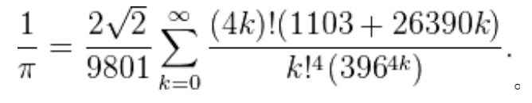

# 实验二

1. Python 流程控制：编写循环控制代码用下面公式逼近圆周率(精确到小数点后 15 位)，并且和 math.pi 的值做比较

   

2. Python 流程控制：阅读 https://en.wikipedia.org/wiki/Koch_snowflake，通过修改 koch.py 绘制其中一种泛化的 Koch 曲线

3. 生日相同情形的概率分析： 

   - 生成 M（M>=1000）个班级，每个班级有 N 名同学，用 input 接收 M 和 N；
   - 用 random 模块中的 randint 生成随机数作为 N 名同学的生日； 
   - 计算 M 个班级中存在相同生日情况的班级数 Q，用 P=Q/M 作为对相同生日概率的估计； 
   - 分析 M，N 和 P 之间的关系。

4. 参照验证实验1中反序词实现的例示代码，设计Python程序找出words.txt中最长的“可缩减单词”（所谓“可缩减单词”是指：每次删除单词的一个字母，剩下的字母依序排列仍然是一个单词，直至单字母单词’a’或者‘i'）。**提示：**
   - 可缩减单词例示：sprite —〉spite —〉spit—〉pit—〉it—〉i 
   - 如果递归求解，可以引入单词空字符串’’作为基准。
   - 一个单词的子单词不是可缩减的单词，则该单词也不是可缩减单词。因此，记录已经查找到的可缩减单词可以提速整个问题的求解。